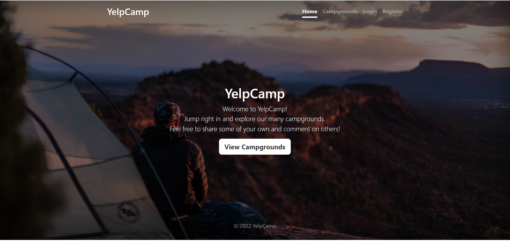
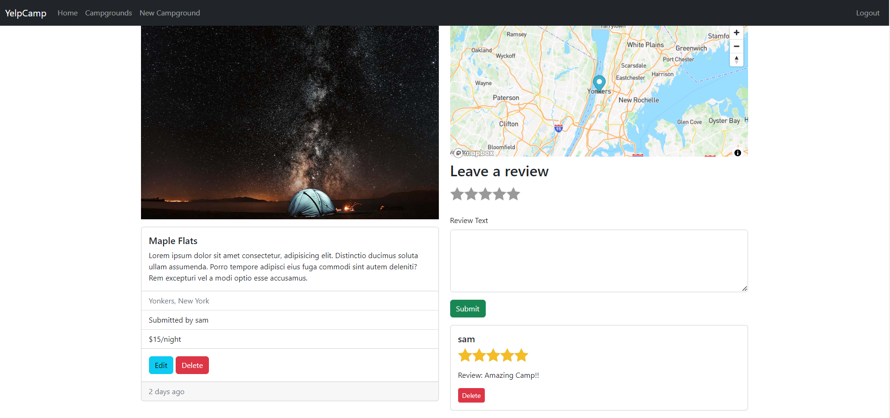
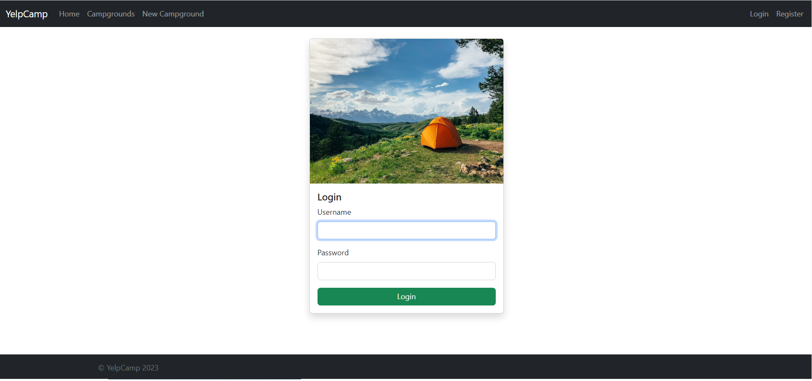
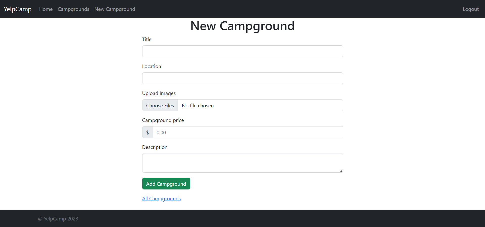
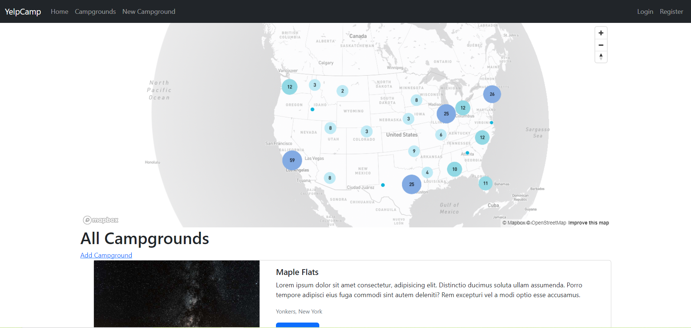
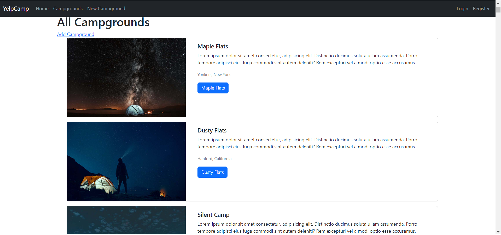

# YelpCamp

YelpCamp is a comprehensive web application project focused on sharing campgrounds. Built with Node.js, Express, EJS, MongoDB Atlas, and other technologies, it allows users to create, edit, delete, rate and review campgrounds. Try the live demo [here](https://yelpcamp-ah2x.onrender.com/).



## Features

- User registration and authentication (login/logout)
- Create, read, update, and delete (CRUD) functionality for campgrounds
- Users can rate and review campgrounds
- Interactive campground maps and cluster maps using Mapbox
- Image uploads for campground photos using Cloudinary
- Input sanitization for security
- RESTful API design
- Flash messages for user interaction
- Session handling for user login persistence
- camp maps and cluster maps using Mapbox

## Screenshots

**Campground Page**



**Login Page**



**New Campground Page**



**Campgrounds List**




## Technologies Used

- [Node.js](https://nodejs.org/)
- [Express](https://expressjs.com/)
- [EJS](https://ejs.co/)
- [MongoDB Atlas](https://www.mongodb.com/cloud/atlas)
- [Mapbox](https://www.mapbox.com/)
- [Cloudinary](https://cloudinary.com/)
- [Passport.js](http://www.passportjs.org/)
- [Mongoose](https://mongoosejs.com/)
- [Multer](https://github.com/expressjs/multer)
- [connect-flash](https://github.com/jaredhanson/connect-flash)
- [dotenv](https://github.com/motdotla/dotenv)
- [express-session](https://github.com/expressjs/session)
- [helmet](https://helmetjs.github.io/)
- [joi](https://joi.dev/)
- [method-override](https://github.com/expressjs/method-override)
- [sanitize-html](https://github.com/apostrophecms/sanitize-html)
- [express-mongo-sanitize](https://github.com/fiznool/express-mongo-sanitize)
- [passport-local-mongoose](https://github.com/saintedlama/passport-local-mongoose)
- [multer-storage-cloudinary](https://github.com/affanshahid/multer-storage-cloudinary)
- [connect-mongo](https://github.com/jdesboeufs/connect-mongo)

## Installation & Setup

1. Clone this repo on your local machine
2. Install the dependencies:
3. Create a `.env` file in the root directory and fill in your environment variables

```
CLOUDINARY_CLOUD_NAME=your_cloud_name
CLOUDINARY_KEY=your_cloudinary_key
CLOUDINARY_SECRET=your_cloudinary_secret
MAPBOX_TOKEN=your_mapbox_token
DATABASE_URL=your_mongodb_atlas_database_url
SECRET=your_session_secret
DB_URL=your_mongodb_or_mongodb_atlas_url
```

4. Start the server:

5. Visit `http://localhost:4000` in your browser

## Contributing

Pull requests are welcome. For major changes, please open an issue first to discuss what you would like to change.

## License

[MIT](https://choosealicense.com/licenses/mit/)
